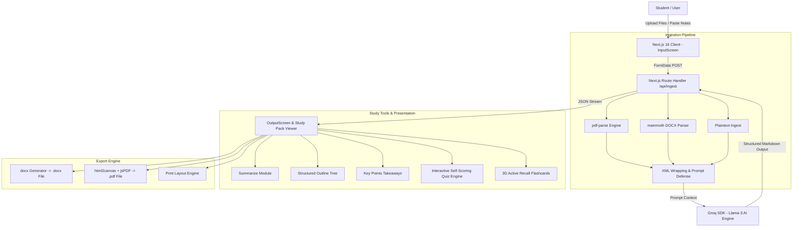

# 🐝 BeeSharp — AI-Powered Study Pack Generator

[](https://nextjs.org/)
[](https://react.dev/)
[](https://www.typescriptlang.org/)
[](https://tailwindcss.com/)
[](https://groq.com/)
[](LICENSE)

**BeeSharp** is an AI-powered study companion application engineered to transform raw educational materials—such as lecture slides, PDF textbooks, Word documents, and typed notes—into structured, interactive, and exportable study packs in seconds. Built with Next.js 16, React 19, and the Groq Llama-3 AI SDK, BeeSharp automates study material creation through active recall tools, flashcards, interactive quizzes, structured outlines, and executive summaries.

---

## 📌 Executive Summary & Context

### **The Problem**
Students and educators spend hours manually formatting summaries, writing flashcards, and creating practice quizzes from dense lecture slides and multi-page PDFs. This administrative overhead reduces time spent on actual learning and active recall.

### **The Solution**
**BeeSharp** ("The bees filter the noise and keep the honey") automates study prep using high-speed LLM processing. Users upload up to 3 documents (PDF, DOCX, TXT) or paste raw class notes, select their preferred study tools via a honeycomb interactive grid, and instantly receive a multi-tool study pack featuring source-attributed summaries, flashcards, interactive self-scoring quizzes, and structured outlines.

---

## 🌟 Key Functional Modules & Features

### 📄 1. Multi-Format Ingestion Engine
* **Multi-File Upload:** Supports drag-and-drop ingestion of PDFs (`pdf-parse`), Microsoft Word files (`mammoth`), and plaintext notes.
* **Security & Prompt Defense:** Implements XML tagging (`<user_provided_study_material>`) around untrusted user inputs to defend against prompt injection attacks.
* **File Validation:** Includes client/server validation enforcing maximum file counts (up to 3 files) and combined payload caps (4MB total).

### 🐝 2. Honeycomb Interactive Study Tool Selector
Users select up to 3 customized study modules per generation:
* **Summarize:** Source-attributed executive summaries isolating core topics per uploaded file.
* **Structured Outline:** Hierarchical topic trees (I. Core Concepts → A. Sub-topics → 1. Details).
* **Key Points:** Bulleted takeaways, essential formulas, and core terminology.
* **Interactive Quiz Engine:** Multiple-choice quiz generator complete with interactive option selection, real-time score tracking, instant answer validation, and explanation reveals.
* **3D Digital Flashcards:** Interactive flip-cards enabling active recall testing with card navigation and term/definition flipping.

### 📍 3. Source Attribution Parsing
* **Multi-Source Tagging:** Automatically tags generated outputs by document source (`[SOURCE 1: Lecture1.pdf]`), allowing students to synthesize multi-file study packs without losing context of the original materials.

### 📥 4. Multi-Format Export Engine
* **Native Word Document Export (`docx`):** Converts study packs into fully formatted Microsoft Word `.docx` documents with styled headers, bullet lists, and tables.
* **Print-Perfect PDF Generation (`jspdf` + `html2canvas-pro`):** Renders high-resolution PDF study sheets directly in the browser.
* **Print-Optimized Worksheets:** Includes dedicated print layouts with `@media print` CSS rules for physical paper study sheets.

---

## 🛠️ Technology Stack & Architecture

### **Frontend & Framework**
* **Framework:** Next.js 16 (App Router) + React 19 (Server/Client Components)
* **Language:** TypeScript 5
* **Styling & UI:** Tailwind CSS (v4) + Custom Hexagonal Honeycomb Component Design System

### **AI & Server Processing**
* **AI Provider:** Groq SDK (`groq-sdk`) utilizing Llama-3 high-throughput inference engines (<1.5 second responses).
* **API Architecture:** Next.js App Router Route Handlers (`app/api/ingest`, `app/api/quiz`).
* **Text Processing Parsers:** `pdf-parse` (PDF extraction), `mammoth` (Microsoft Word extraction).

### **Export & Security Libraries**
* **Document Generation:** `docx` (Word export), `jspdf` + `html2canvas-pro` (PDF rendering), `file-saver`.
* **Markdown & Sanitation:** `react-markdown`, `marked`, `rehype-sanitize` for safe HTML rendering against XSS attacks.

---

## 📐 System Architecture Diagram



---

## 🏆 Key Software Engineering Highlights

1. **Ultra-Fast LLM Processing Pipeline:** Leveraged Groq Llama-3 inference acceleration to process multi-document study packs in under 2 seconds.
2. **Prompt Injection Hardening:** Implemented boundary defense tags to prevent malicious user file content from overriding system instructions during LLM ingestion.
3. **Interactive Active Recall Systems:** Engineered stateful React 19 components for real-time quiz validation and 3D CSS flashcard flip mechanics.
4. **Native Client-Side Document Synthesis:** Created an export pipeline converting structured markdown responses directly into styled Word documents and print-ready PDFs without server dependencies.

---

## 🚀 Getting Started

### Prerequisites
* **Node.js**: v18.0.0 or higher
* **pnpm / npm**: pnpm v8+ or npm v9+
* **Groq API Key**: Obtainable from [Groq Console](https://console.groq.com/)

### Installation & Setup

```bash
# Clone the repository
git clone https://github.com/Julio-DelRosario/bee-sharp-app.git
cd bee-sharp-app

# Install dependencies
pnpm install # or npm install

# Set up environment variables
cp .env.example .env.local
# Add your GROQ_API_KEY inside .env.local:
# GROQ_API_KEY=your_groq_api_key_here

# Run development server
pnpm dev # or npm run dev
```

Open [http://localhost:3000](http://localhost:3000) in your browser.

---

## 📄 License

This project is open-source and available under the [MIT License](LICENSE).
